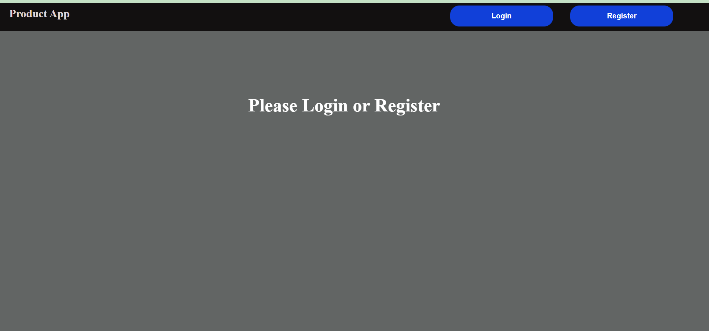
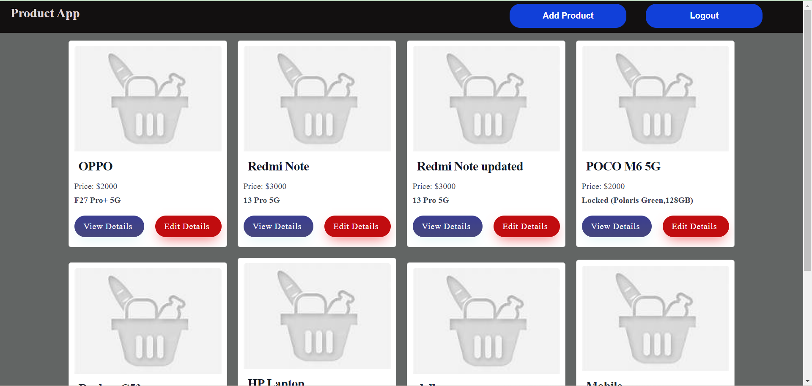

# Ecommerce App:

## Introduction
Create a web application that displays a list of products, allows users to view details of
individual products, and provides authentication using JWT tokens. The application
should use ReactJS, Redux, React Router, and Axios for frontend development, and
Node with Express Framework for backend API development. The data should be
stored in MongoDB Server. The entire application should be containerized and
deployable.

## Requirements:

  Authentication:
    o Implement user registration and login endpoints.
    o Secure product endpoints with JWT authentication.

  Products:
    o Create endpoints for:
        ▪ Fetching the list of products.
        ▪ Fetching product details by ID.
        ▪ Creating a new product.
        ▪ Editing an existing product.

## Project Type
Frontend and Backend

## Deployed App
Frontend: [Live Demo](https://web-app-jade-five-44.vercel.app/)
Backend: [Live Demo](https://web-app-backend-nu.vercel.app/)

## Features
**Responsive Layout:** The layout is optimized for both mobile and desktop views, ensuring a seamless user experience across devices.

**Feature Implementation:** 
   - The application features a responsive and visually appealing Navbar with options to go to the
   register or login.
   - After login,product list is displayed on the home page. add a product and logout option is showing in navbar. 
   - When the user clicks on "Add Product", a form is displayed to fill in the product details (name, price, description). After submitting the form, the product is successfully added and the user is redirected back to the home page. The updated product list is displayed.
   - If the user wants to edit a product, they can click on the "Edit" button. The edit form is displayed, allowing the user to modify the product details. After submitting the form, the product is successfully updated. The user is redirected back to the home page, and the updated product list is displayed.
   - To View a product, the user can click on the "View" button. The product is Viewed to particular product.
   - It was Responsive 
   - We can logout 

Backend:
1. Test the API's in Postman:

**Auth API's**

| Methods | API URL                                                       |
|---------|---------------------------------------------------------------|
|  POST    | https://web-app-backend-nu.vercel.app/api/auth/register      |
|  POST    | https://web-app-backend-nu.vercel.app/api/auth/login         |

**Product API's**

| Methods | API URL                                                     |
|---------|-------------------------------------------------------------|
|  GET     | https://web-app-backend-nu.vercel.app/api/products         |
|  GET     | https://web-app-backend-nu.vercel.app/api/products/{id}    |
|  POST    | https://web-app-backend-nu.vercel.app/api/products         |
|  PUT     | https://web-app-backend-nu.vercel.app/api/products/{id}    |
  
2. connect with Mongodb altas
3. create the model,routes to manage the database

    
## Design Decisions or Assumptions

## Installation & Getting Started
To run the project locally, follow these steps:

### Clone the repository

    git clone https://github.com/Sravani0410/web-app.git
    

### Navigate to the project directory

    Frontend:cd backend
    Backend: cd frontend

### Install dependencies
 
   Frontend and Backend: npm install 

### Start the application

   Frontend: npm start
   Backend:npm start

## Usage

## Technology Stack

**Frontend:** React,Redux-toolkit

**CSS:** Implement CSS 

**Backend:** Node,Express

**MongoDB Atlas:** To store the data in global cloud-based database service designed for developing modern applications.

**Deployment:** 
   Backend :   vercel,
   Frontend :  vercel
---
